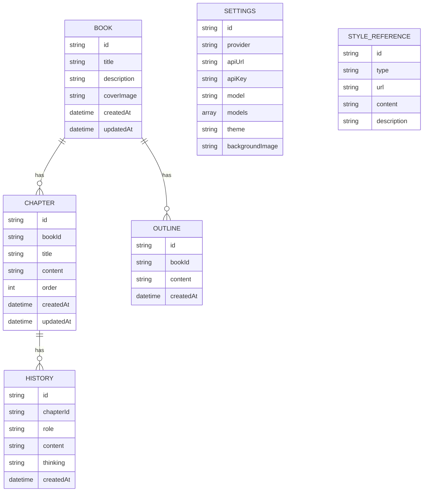

# AI写作助手 - 技术架构文档

## 1. 架构设计
```mermaid
graph TB
    subgraph 前端
        A[React 应用]
        B[状态管理 Zustand]
        C[UI组件库]
        D[本地存储 localStorage]
    end
    subgraph 外部服务
        E[AI API服务]
        F[书源API]
    end
    A &lt;--&gt; B
    A &lt;--&gt; C
    A &lt;--&gt; D
    A --&gt; E
    A --&gt; F
```

## 2. 技术描述
- 前端: React@18 + TypeScript + tailwindcss@3 + vite
- 初始化工具: vite-init
- 后端: 无（纯前端应用）
- 数据存储: localStorage (本地存储)
- 状态管理: Zustand
- UI图标: lucide-react

## 3. 路由定义
| 路由 | 用途 |
|------|------|
| / | 主编辑页面 |

## 4. 数据模型

### 4.1 数据模型定义


### 4.2 数据存储结构
数据完全存储在用户浏览器的localStorage中，使用以下键名：
- `writing_assistant_books`: 书籍列表
- `writing_assistant_chapters`: 章节列表
- `writing_assistant_outlines`: 大纲列表
- `writing_assistant_history`: 对话历史
- `writing_assistant_settings`: 设置配置
- `writing_assistant_references`: 风格参考

## 5. 核心功能实现

### 5.1 API配置与模型管理
- 支持的API供应商: OpenAI API兼容、OpenAI Responses API兼容、Claude API兼容、Google Gemini API兼容
- 模型获取: 调用对应API的models接口获取可用模型列表
- 连接测试: 发送简单测试请求验证配置是否正确
- 模型选择: 下拉列表展示获取到的模型，点击自动填充

### 5.2 AI生成功能
- 流式生成: 使用Fetch API的ReadableStream实现流式响应
- 生成控制: 支持开始生成、停止生成、继续生成、重写
- 字数约束: 在提示词中指定生成字数
- 上下文记忆: 将历史对话和之前剧情作为上下文

### 5.3 风格参考
- 书源集成: 内置书源API，支持访问和解析
- 文件上传: 支持上传txt、图片等文件
- 链接参考: 支持输入URL获取内容参考
- 风格提取: 将参考内容转换为风格提示词

### 5.4 大纲与章节规划
- 大纲生成: 根据现有剧情或用户输入生成大纲
- 细纲编辑: 可编辑每一章的详细剧情规划
- 章节生成: 根据大纲生成对应章节内容

## 6. UI组件结构
```
App
├── Header (顶部栏)
├── SidebarLeft (作品管理侧边栏)
├── MainContent
│   ├── Toolbar (工具栏: 生成/停止/继续按钮)
│   ├── Editor (写作编辑区)
│   ├── OutlinePanel (大纲面板)
│   └── HistoryPanel (历史记录)
└── SidebarRight (设置侧边栏)
    ├── ApiSettings (API设置)
    ├── ThemeSettings (主题设置)
    └── StyleReference (风格参考)
```
