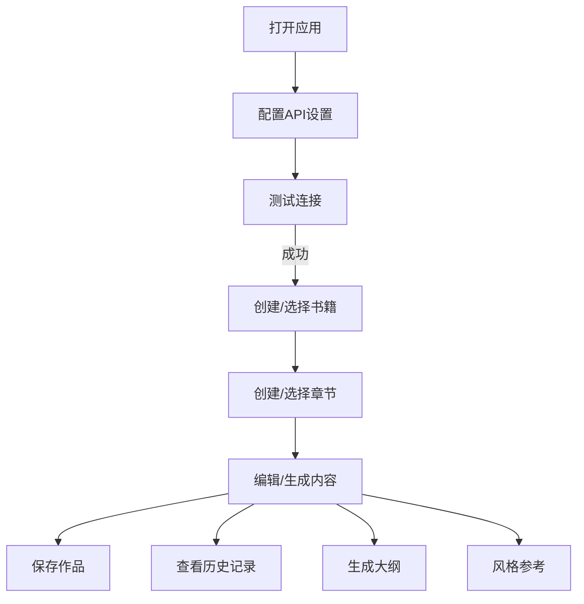

# AI写作助手 - 产品需求文档

## 1. 产品概述
AI写作助手是一款功能丰富的小说创作工具，支持用户配置自己的AI模型API，通过AI辅助完成小说创作的各个环节。
- 解决用户在小说创作过程中缺乏灵感、大纲规划困难、续写效率低等问题，目标用户为网络小说作者、业余写作爱好者
- 提供完整的创作流程支持，包括大纲生成、章节续写、风格参考、历史记录管理等

## 2. 核心功能

### 2.1 用户角色
| 角色 | 注册方式 | 核心权限 |
|------|---------|---------|
| 普通用户 | 无需注册 | 完全使用所有功能，数据存储在本地 |

### 2.2 功能模块
1. **设置面板**：API配置、模型管理、主题设置
2. **作品管理**：创建/上传书籍、管理章节
3. **AI写作**：生成、停止、继续、重写功能
4. **大纲规划**：大纲生成、细纲编辑、章节规划
5. **风格参考**：书源访问、风格溯源、文件/链接参考
6. **历史记录**：对话历史、作品历史、快速切换

### 2.3 页面详情
| 页面名称 | 模块名称 | 功能描述 |
|---------|---------|---------|
| 主编辑页 | 设置面板 | 右侧侧边栏，配置API供应商、地址、密钥，获取模型列表，测试连接 |
| 主编辑页 | 作品管理 | 左侧侧边栏，创建书籍、章节，管理作品集 |
| 主编辑页 | 写作区域 | 编辑当前章节内容，气泡式对话显示 |
| 主编辑页 | 大纲面板 | 生成/编辑大纲，规划章节剧情 |
| 主编辑页 | 风格参考 | 书源访问，上传文件/图片，输入链接参考风格 |

## 3. 核心流程
用户首先在设置面板配置API信息并测试连接，成功后创建或选择书籍，进入章节编辑，使用AI辅助创作，支持大纲规划、风格参考、历史记录回溯等功能。

## 4. 用户界面设计

### 4.1 设计风格
- **主色调**：原木色 (#8B7355) 和 橙色 (#FF8C00) 撞色主题
- **按钮风格**：圆角按钮，带有轻微阴影，悬停有缩放效果
- **字体**：标题使用 "Playfair Display" 或类似衬线字体，正文使用 "Source Serif Pro" 等优雅字体
- **布局风格**：双侧边栏布局（左作品，右设置），中间主编辑区
- **图标风格**：使用线性图标，与整体风格统一

### 4.2 页面设计概览
| 页面名称 | 模块名称 | UI元素 |
|---------|---------|--------|
| 主编辑页 | 设置面板 | 原木色边框，橙色强调按钮，圆角设计，表单区域清晰分隔 |
| 主编辑页 | 作品管理 | 树形结构，文件夹图标，点击展开/折叠，选中项高亮 |
| 主编辑页 | 写作区域 | 电子书风格，仿纸张背景，舒适的行高和字间距 |
| 主编辑页 | 控制栏 | 生成、停止、继续按钮，原木色和橙色区分功能 |

### 4.3 响应式
桌面端为主，平板自适应，移动端简化侧边栏为底部导航

### 4.4 设计细节
- 整体风格温暖、舒适，符合创作氛围
- 使用纸张质感背景，营造写作环境
- 平滑过渡动画，提升使用体验
- 合理的阴影层次，增加界面深度
