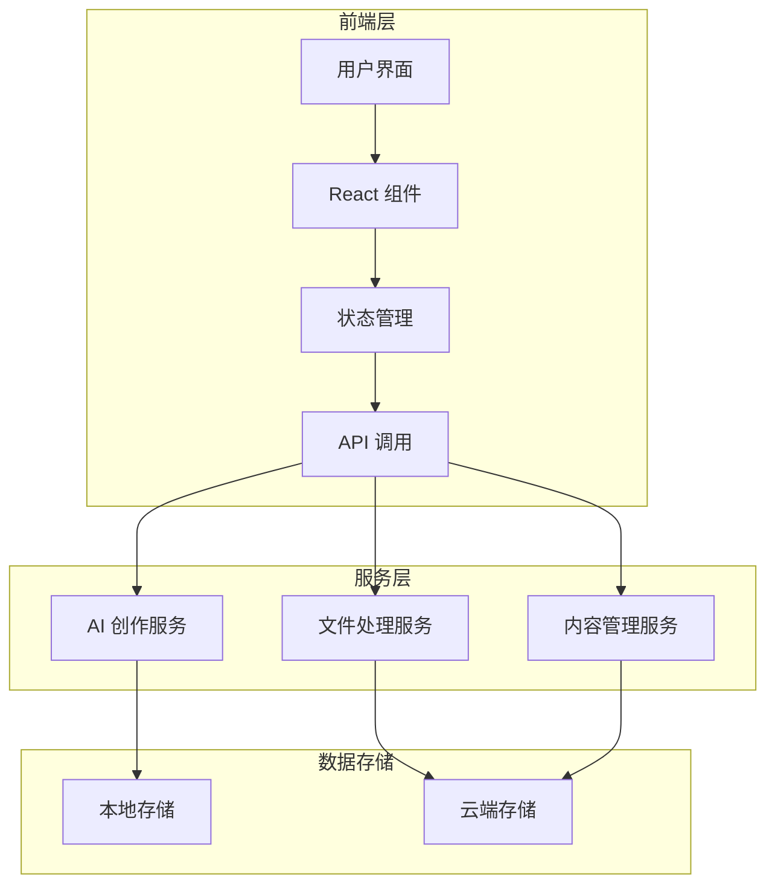
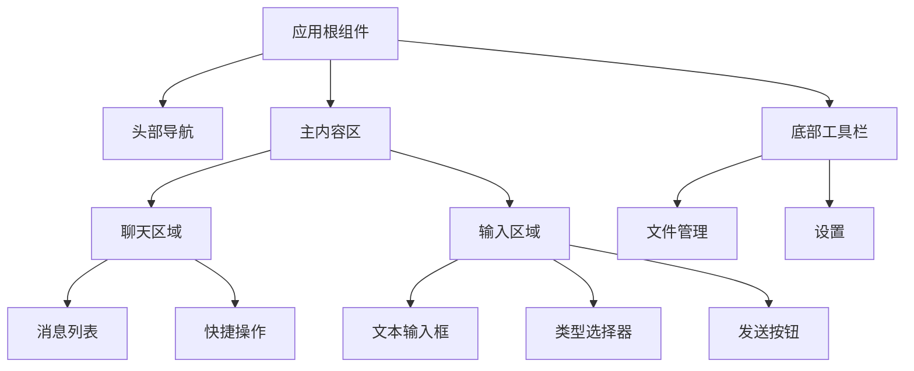
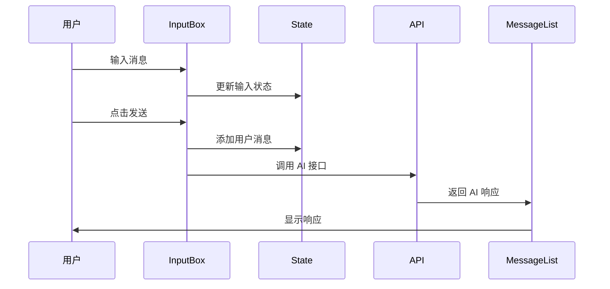

# 小说创作助手 - 技术架构文档

## 技术栈选择

### 前端框架
- **框架**: React 18 + TypeScript
- **构建工具**: Vite
- **UI 组件**: 原生 HTML/CSS + 自定义组件
- **状态管理**: React Hooks (useState, useReducer, useContext)
- **样式方案**: CSS Modules + CSS Variables

### 核心技术
- **语言**: TypeScript (类型安全)
- **样式**: 现代 CSS (Flexbox, Grid, Custom Properties)
- **动画**: CSS Animations + Transitions
- **HTTP 客户端**: Fetch API

## 系统架构

### 整体架构图



## 组件架构

### 核心组件树



## 核心模块设计

### 1. 聊天交互模块

**职责**: 处理用户与 AI 的对话交互

**核心组件**:
- `ChatContainer`: 聊天容器组件
- `MessageList`: 消息列表组件
- `MessageItem`: 单条消息组件
- `InputBox`: 输入框组件

**数据流**:


### 2. 文件管理模块

**职责**: 处理参考小说的上传和解析

**核心功能**:
- 文件上传 (拖拽/点击)
- 文件类型验证
- 文本内容提取
- 进度显示

### 3. 类型选择模块

**职责**: 选择小说类型和创作模式

**支持类型**:
- 女频言情
- 古言仙侠
- 男频爽文
- 悬疑推理
- 历史古风
- 科幻末世

### 4. 快捷指令模块

**职责**: 提供常用创作指令模板

**快捷指令**:
- 续写当前章节
- 描写场景
- 改写章节
- 生成对话
- 创作情节

## 数据结构设计

### 消息结构

```typescript
interface Message {
  id: string;
  role: 'user' | 'assistant' | 'system';
  content: string;
  timestamp: number;
  type?: NovelType;
  attachments?: FileAttachment[];
}
```

### 小说类型

```typescript
enum NovelType {
  ROMANCE = 'romance', // 女频言情
  ANCIENT = 'ancient', // 古言仙侠
  MALE = 'male', // 男频爽文
  MYSTERY = 'mystery', // 悬疑推理
  HISTORICAL = 'historical', // 历史古风
  SCI_FI = 'sci-fi', // 科幻末世
}
```

### 创作会话

```typescript
interface CreationSession {
  id: string;
  title: string;
  novelType: NovelType;
  style: WritingStyle | null;
  messages: Message[];
  createdAt: number;
  updatedAt: number;
}
```

## 状态管理

### 全局状态

```typescript
interface AppState {
  currentSession: CreationSession | null;
  sessions: CreationSession[];
  writingStyle: WritingStyle | null;
  isLoading: boolean;
  error: Error | null;
}
```

### Action Types

```typescript
type Action =
  | { type: 'SEND_MESSAGE'; payload: Message }
  | { type: 'RECEIVE_RESPONSE'; payload: Message }
  | { type: 'UPLOAD_FILE'; payload: File }
  | { type: 'SET_NOVEL_TYPE'; payload: NovelType }
  | { type: 'LOAD_SESSION'; payload: CreationSession }
  | { type: 'CLEAR_ERROR' };
```

## API 接口设计

### 核心接口

```typescript
interface NovelWritingAPI {
  // 发送创作请求
  createContent(params: CreateContentParams): Promise<ContentResponse>;
  
  // 上传参考文件
  uploadReference(file: File): Promise<UploadResponse>;
  
  // 学习写作风格
  learnStyle(fileId: string): Promise<StyleResponse>;
  
  // 续写章节
  continueChapter(context: ChapterContext): Promise<ChapterResponse>;
  
  // 改写内容
  rewriteContent(content: string, options: RewriteOptions): Promise<ContentResponse>;
}
```

## 性能优化策略

### 1. 代码分割
- 按路由懒加载组件
- 大型组件异步加载

### 2. 渲染优化
- React.memo 缓存纯组件
- useMemo/useCallback 优化计算
- 虚拟列表优化长消息列表

### 3. 网络优化
- 请求防抖 (输入框)
- 响应式图片加载
- 本地缓存策略

### 4. 资源优化
- 图标使用 SVG Sprite
- CSS 压缩和 Tree Shaking
- 字体子集化

## 安全策略

### 输入验证
- XSS 防护 (内容转义)
- 文件类型验证
- 输入长度限制

### 数据安全
- 敏感信息加密存储
- HTTPS 传输
- CORS 配置

## 部署架构

### 开发环境
```
Vite Dev Server (HMR)
    ↓
本地浏览器
```

### 生产环境
```
构建产物 (dist/)
    ↓
CDN / 静态资源服务器
    ↓
用户浏览器
```

## 技术债务管理

### 已知限制
1. 当前版本使用模拟数据，需后续接入真实 API
2. 文件处理功能需要后端支持
3. 风格学习算法需要 AI 模型集成

### 后续优化
1. 接入真实 AI 创作 API
2. 实现离线 PWA 支持
3. 添加协作编辑功能
4. 支持更多文件格式

## 开发规范

### 代码规范
- ESLint + Prettier
- TypeScript strict 模式
- 组件命名规范

### Git 规范
- Feature branch 工作流
- Conventional Commits
- PR Review 机制

### 测试策略
- 单元测试 (Jest)
- 组件测试 (React Testing Library)
- E2E 测试 (Playwright)
